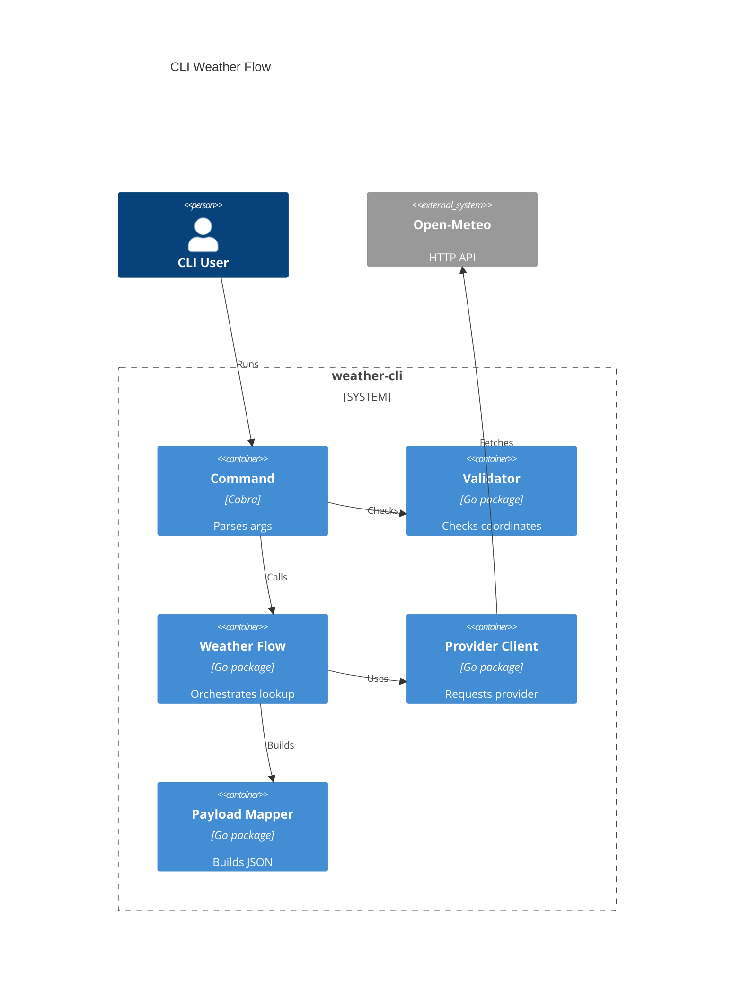

# Implementation Plan: CLI Weather Flow

**Branch**: `[00001-cli-weather-flow]` | **Date**: 2026-04-06 | **Spec**: [spec.md](C:/Endava/EndevLocal/Repos/weather-cli-demo-2/specs/00001-cli-weather-flow/spec.md)

## Summary

**Goal**: Deliver the first runnable Go CLI that validates coordinates, calls Open-Meteo, and emits the approved MVP weather JSON payload.  
**Approach**: Build a small command layer, validation path, provider client, and response mapper under `/src`, backed by unit and integration-style tests with mocked upstream responses.  
**Key Constraint**: Keep the implementation stateless, source-rooted under `/src`, and limited to the MVP payload and lightweight failure behavior defined in the clarified spec.

## Technical Context

**Language/Version**: Go 1.24  
**Primary Dependencies**: Cobra, Go standard library HTTP/JSON packages, Open-Meteo HTTP API  
**Storage**: N/A  
**Testing**: `go test`, table-driven unit tests, `httptest` integration-style provider tests  
**Target Platform**: Desktop CLI on macOS, Windows, and Linux  
**Project Type**: single  
**Project Mode**: greenfield  
**Performance Goals**: Median successful command completion <= 2 seconds; validation path completes before network I/O  
**Constraints**: Standalone executable only, all implementation files under `/src`, no persistent storage, success payload limited to approved MVP fields, provider failures must not produce weather payloads  
**Scale/Scope**: One coordinate pair per invocation, single-user CLI execution, first runnable MVP flow only

## Instructions Check

*GATE: Must pass before Phase 0 research. Re-check after Phase 1 design.*

| Principle | Status | Notes |
|-----------|--------|-------|
| Simplicity First | PASS | Plan keeps scope to the first runnable lookup flow and avoids release automation or final contract-hardening work |
| Contract Stability | PASS | Payload fields and validation boundaries are explicit and mapped to stable internal components |
| Testable Reliability | PASS | Validation, provider mapping, and failure paths all have concrete test coverage in the plan |
| Release Automation Early | PASS | This feature does not block the planned early CI/release epic and preserves binary naming and layout for it |
| Source Code Layout | PASS | All implementation paths are placed under `/src` |

## Architecture



## Architecture Decisions

| ID | Decision | Options Considered | Chosen | Rationale |
|----|----------|--------------------|--------|-----------|
| AD-001 | CLI entry structure | Flat `main.go` only / Cobra command package | Cobra command package | Aligns with project technical context and keeps later command growth manageable |
| AD-002 | Validation boundary | Validate inside provider client / fail-fast before service call | Fail-fast before provider call | Satisfies spec requirement that invalid coordinates never trigger upstream requests |
| AD-003 | Success payload assembly | Pass through provider JSON / map to MVP payload | Map to MVP payload | Preserves approved fields and avoids upstream schema leakage |
| AD-004 | Failure testing approach | Live provider tests only / mocked provider tests | Mocked provider tests with `httptest` | Keeps tests deterministic while covering timeout and unusable-response paths |

## Data Model Summary

| Entity | Key Fields | Relationships | Notes |
|--------|------------|---------------|-------|
| CoordinateInput | latitude, longitude | Produces ProviderRequest | Parsed from CLI args and range-validated |
| ProviderRequest | latitude, longitude, current_fields | Returns ProviderResponse or ProviderFailure | Created only after validation |
| ProviderResponse | latitude, longitude, current.* fields | Maps to MVPWeatherPayload | Missing required fields become failure path |
| MVPWeatherPayload | coordinates, current.temperature, current.wind_speed, current.wind_direction, current.weather_code, observation_timestamp | Produced from ProviderResponse | Approved MVP success shape only |
| ProviderFailure | error_type, message | Alternative to MVPWeatherPayload | Lightweight machine-readable failure result |

**Detail**: `specs/00001-cli-weather-flow/data-model.md`

## API Surface Summary

| Method | Path | Purpose | Auth | Req/Res Types |
|--------|------|---------|------|---------------|
| GET | `/v1/forecast` | Fetch current weather for validated coordinates | none | `ProviderRequest` -> `ProviderResponse` |

**Detail**: `specs/00001-cli-weather-flow/contracts/`

## Testing Strategy

| Tier | Tool | Scope | Mock Boundary | Install |
|------|------|-------|---------------|---------|
| Unit | `go test` | Coordinate parsing, range validation, payload mapping | Mock provider payload structs or fixtures | configured |
| Integration | `go test` + `httptest` | Weather flow against simulated Open-Meteo responses and transport failures | Mock external provider only | configured |
| Security | `govulncheck` | Go module dependency and code vulnerability scan | — | `go install golang.org/x/vuln/cmd/govulncheck@latest` |
| Coverage | `go test -coverprofile` | Feature package coverage measurement toward 80% target | — | configured |

## Error Handling Strategy

| Error Category | Pattern | Response | Retry |
|----------------|---------|----------|-------|
| Validation | fail-fast | machine-readable failure result, no provider call | no |
| Downstream transport | bounded timeout | machine-readable failure result, loggable internal detail | no |
| Downstream data | fail-closed | machine-readable failure result, no weather payload | no |

## Integration Points

| Spec Reference | System/Service | Technical Approach | Contract |
|----------------|----------------|--------------------|----------|
| FR-003 | Open-Meteo | Dedicated provider client using validated coordinates and fixed current-field query parameters | `contracts/open-meteo-current-weather.md` |
| FR-007 | Open-Meteo | Convert transport or unusable-response failures into lightweight failure result | `contracts/open-meteo-current-weather.md` |

## Risk Mitigation

| Risk (from spec) | Likelihood | Impact | Mitigation | Owner |
|-------------------|------------|--------|------------|-------|
| Upstream dependency volatility | M | H | Isolate provider call and mapping logic, require mocked failure-path tests, and validate required fields before success output | Provider Client |
| Input ambiguity | L | M | Centralize CLI argument validation and document coordinate-only contract in command help and tests | Command |
| Early contract drift | M | M | Define explicit MVP payload structs and map every field through tested response builders | Payload Mapper |

## Requirement Coverage Map

| Req ID | Component(s) | File Path(s) | Notes |
|--------|--------------|--------------|-------|
| FR-001 | Command, Validator | `src/cmd/weathercli/root.go`, `src/internal/validation/coordinates.go` | Parse latitude and longitude as explicit required inputs |
| FR-002 | Validator | `src/internal/validation/coordinates.go` | Enforce presence and valid geographic ranges before service call |
| FR-003 | Weather Flow, Provider Client | `src/internal/weather/service.go`, `src/internal/provider/openmeteo/client.go` | Perform validated Open-Meteo request |
| FR-004 | Payload Mapper, Command | `src/internal/output/payload.go`, `src/cmd/weathercli/root.go` | Emit JSON on success |
| FR-005 | Payload Mapper | `src/internal/output/payload.go` | Limit success payload to approved MVP fields |
| FR-006 | Validator, Command | `src/internal/validation/coordinates.go`, `src/cmd/weathercli/root.go` | Invalid input yields failure without provider request |
| FR-007 | Provider Client, Weather Flow, Payload Mapper | `src/internal/provider/openmeteo/client.go`, `src/internal/weather/service.go`, `src/internal/output/failure.go` | Convert transport and unusable-data failures into machine-readable failure result |
| FR-008 | Validation tests, Provider tests | `src/internal/validation/coordinates_test.go`, `src/internal/provider/openmeteo/client_test.go`, `src/internal/weather/service_test.go` | Automated verification for validation and mapping paths |

## Project Structure

### Source Code

```text
src/
  cmd/
    weathercli/
      main.go
      root.go
  internal/
    output/
      failure.go
      payload.go
    provider/
      openmeteo/
        client.go
        types.go
    validation/
      coordinates.go
    weather/
      service.go
      types.go
  tests/
    testdata/
      openmeteo-success.json
      openmeteo-invalid.json
```

## Implementation Hints

- **[HINT-001]** Order: Create the payload structs before wiring command output so requirement coverage stays explicit and testable.
- **[HINT-002]** Constraint: Keep provider field names isolated in the Open-Meteo package; downstream packages should use internal weather and payload types only.
- **[HINT-003]** Gotcha: Validation must distinguish malformed numeric input from out-of-range values because both should fail before any network call.
- **[HINT-004]** Compatibility: Preserve a stable binary entry name and `/src/cmd/weathercli` entrypoint so the CI/release epic can layer on without path churn.
