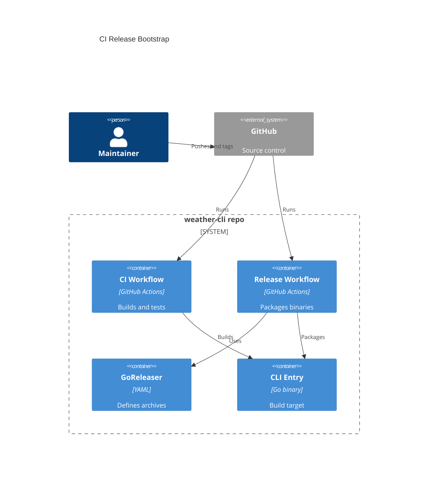

# Implementation Plan: CI Release Bootstrap

**Branch**: `[00002-ci-release-bootstrap]` | **Date**: 2026-04-06 | **Spec**: [spec.md](C:/Endava/EndevLocal/Repos/weather-cli-demo-2/specs/00002-ci-release-bootstrap/spec.md)

## Summary

**Goal**: Add repository-native CI validation and cross-platform release packaging for the Go CLI using GitHub Actions and GoReleaser.  
**Approach**: Create one validation workflow, one release workflow, and one GoReleaser config aligned to the existing module and `/src/cmd/weathercli` entrypoint, then verify them with local snapshot commands where possible.  
**Key Constraint**: Keep the pipeline on GitHub Actions and GoReleaser only, with no change to the public CLI contract or packaging targets outside macOS, Windows, and Linux.

## Technical Context

**Language/Version**: Go 1.24  
**Primary Dependencies**: GitHub Actions, GoReleaser, Go standard toolchain  
**Storage**: N/A  
**Testing**: `go test ./...`, `go build ./...`, GoReleaser snapshot validation  
**Target Platform**: GitHub-hosted CI plus packaged binaries for macOS, Windows, and Linux  
**Project Type**: single  
**Project Mode**: mixed  
**Performance Goals**: CI validation should complete with repository-native build/test commands; release packaging should finish without manual per-OS scripting  
**Constraints**: Use existing module layout, preserve `/src/cmd/weathercli` entrypoint, stay within GitHub Actions and GoReleaser, no artifact signing in this epic  
**Scale/Scope**: One repository, one CLI binary, three primary desktop operating systems

## Instructions Check

*GATE: Must pass before Phase 0 research. Re-check after Phase 1 design.*

| Principle | Status | Notes |
|-----------|--------|-------|
| Simplicity First | PASS | Plan creates only the workflows and release config required for the current CLI |
| Contract Stability | PASS | No public CLI interface changes are introduced |
| Testable Reliability | PASS | CI validation, snapshot packaging, and release-path verification are explicit |
| Release Automation Early | PASS | This epic directly implements the required early automation baseline |
| Source Code Layout | PASS | New repository-root files are config/workflow artifacts, not source-code violations |

## Architecture



## Architecture Decisions

| ID | Decision | Options Considered | Chosen | Rationale |
|----|----------|--------------------|--------|-----------|
| AD-001 | CI validation split | Combined release-only workflow / separate validation workflow | Separate validation workflow | Gives fast feedback on push and keeps release concerns isolated |
| AD-002 | Release packaging tool | Custom scripts / GoReleaser | GoReleaser | Matches SAD decision and reduces bespoke cross-platform logic |
| AD-003 | Release verification path | Tagged releases only / snapshot plus tagged release | Snapshot plus tagged release | Allows maintainers to validate packaging config before a real release |

## Data Model Summary

| Entity | Key Fields | Relationships | Notes |
|--------|------------|---------------|-------|
| CI Workflow | trigger, Go version, validation steps | Uses CLI Entry | Repository-managed GitHub Actions validation |
| Release Workflow | trigger, permissions, release steps | Uses GoReleaser Config | GitHub Actions release path |
| GoReleaser Config | builds, archives, snapshot behavior | Packages CLI Entry | Defines cross-platform artifact outputs |
| Release Artifact | os, arch, archive name | Produced by Release Workflow | macOS, Windows, and Linux outputs |

**Detail**: `specs/00002-ci-release-bootstrap/data-model.md`

## API Surface Summary

N/A — no API surface

## Testing Strategy

| Tier | Tool | Scope | Mock Boundary | Install |
|------|------|-------|---------------|---------|
| Unit | `go test ./...` | Existing CLI codebase verification in CI | Mock external provider only | configured |
| Integration | `goreleaser release --snapshot --clean` | Release packaging config validation | Mock GitHub release publication via snapshot mode | `go install github.com/goreleaser/goreleaser/v2@latest` |
| Security | `govulncheck ./...` | Dependency and code vulnerability scan in CI | — | configured |
| Coverage | `go test -coverprofile=coverage.out ./...` | Coverage enforcement in CI against project threshold | — | configured |

## Error Handling Strategy

| Error Category | Pattern | Response | Retry |
|----------------|---------|----------|-------|
| Build/Test failure | fail-fast | fail workflow job and block success status | no |
| Packaging misconfiguration | fail-fast | fail release/snapshot job with actionable logs | no |
| Unsupported trigger usage | explicit documentation | maintainers use documented trigger path | no |

## Integration Points

| Spec Reference | System/Service | Technical Approach | Contract |
|----------------|----------------|--------------------|----------|
| IP-001 | Existing CLI entrypoint | Build and package `./src/cmd/weathercli` consistently | `.goreleaser.yml` |
| IP-002 | Go module and tests | Reuse `go test ./...`, `go build ./...`, coverage, and `govulncheck` in CI | `.github/workflows/ci.yml` |
| IP-003 | Later release-dependent epics | Preserve binary naming and artifact outputs for downstream use | `.goreleaser.yml`, `.github/workflows/release.yml` |

## Risk Mitigation

| Risk (from spec) | Likelihood | Impact | Mitigation | Owner |
|-------------------|------------|--------|------------|-------|
| Workflow drift | M | M | Use repository-native Go commands in workflows and validate them locally before finalizing config | CI Workflow |
| Packaging misconfiguration | M | H | Add GoReleaser snapshot validation and explicit binary path configuration | GoReleaser Config |
| Release trigger ambiguity | L | M | Encode clear trigger comments and workflow naming in repository files | Release Workflow |

## Requirement Coverage Map

| Req ID | Component(s) | File Path(s) | Notes |
|--------|--------------|--------------|-------|
| TR-001 | CI Workflow | `.github/workflows/ci.yml` | Run build and test validation on repository changes |
| TR-002 | CI Workflow | `.github/workflows/ci.yml` | Fail validation on build or test failures |
| TR-003 | GoReleaser Config | `.goreleaser.yml` | Package from `/src/cmd/weathercli` |
| TR-004 | Release Workflow, GoReleaser Config | `.github/workflows/release.yml`, `.goreleaser.yml` | Produce macOS, Windows, and Linux artifacts |
| TR-005 | Release Workflow | `.github/workflows/release.yml` | Make trigger and artifact behavior clear |
| TR-006 | Release Workflow, GoReleaser Config | `.github/workflows/release.yml`, `.goreleaser.yml` | Support snapshot validation before real release |

## Project Structure

### Source Code

```text
~ .github/workflows/ci.yml
+ .github/workflows/release.yml
+ .goreleaser.yml
~ .gitignore
```

**Patterns to reuse**: Existing Go build, test, coverage, and vulnerability commands from the implemented CLI slice  
**Tests to extend**: Repository-level `go test ./...` and coverage generation  
**Naming conventions**: Use lower-case workflow filenames, `weathercli` binary naming, and repository-root YAML config for release automation

## Implementation Hints

- **[HINT-001]** Order: Add CI validation first, then add GoReleaser config, then wire the release workflow around the validated config.
- **[HINT-002]** Constraint: Point GoReleaser at `./src/cmd/weathercli` explicitly so packaging does not rely on repository-root guessing.
- **[HINT-003]** Compatibility: Keep artifact names stable and simple because later epics and maintainers will depend on them.
