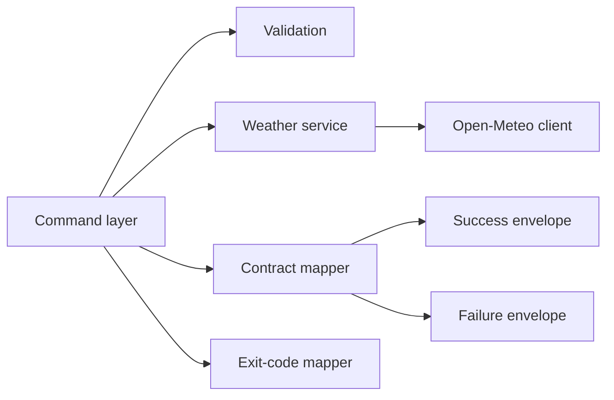

# Implementation Plan: JSON Contract Hardening

**Branch**: `[00003-json-contract-hardening]` | **Date**: 2026-04-06 | **Spec**: [spec.md](C:/Endava/EndevLocal/Repos/weather-cli-demo-2/specs/00003-json-contract-hardening/spec.md)

## Summary

**Goal**: Turn the current MVP JSON output into a stable success and failure contract with shell-visible exit-code semantics.  
**Approach**: Introduce stable output envelope types, centralize failure classification and exit-code mapping in the command layer, and lock the public contract with JSON fixtures and command tests.  
**Key Constraint**: Preserve the existing weather data set and source-rooted Go layout while avoiding raw provider error leakage in the public contract.

## Technical Context

**Language/Version**: Go 1.26.1  
**Primary Dependencies**: Cobra, Go standard library HTTP/JSON packages, Open-Meteo client package already in repo  
**Storage**: N/A  
**Testing**: `go test`, table-driven unit tests, fixture-backed contract assertions  
**Target Platform**: Desktop CLI on macOS, Windows, and Linux  
**Project Type**: single  
**Project Mode**: greenfield  
**Performance Goals**: Contract mapping adds negligible latency beyond the existing request path; no extra network calls  
**Constraints**: All implementation under `/src`; JSON required for both success and failure; distinct exit codes required for non-success outcomes  
**Scale/Scope**: One coordinate pair per invocation, one stable public contract for automation users

## Instructions Check

| Principle | Status | Notes |
|-----------|--------|-------|
| Simplicity First | PASS | Plan reshapes existing output and command flow without adding new product capability areas |
| Contract Stability | PASS | Output envelopes, error codes, and exit codes are centralized and test-locked |
| Testable Reliability | PASS | Each public contract path has fixture-driven tests and exit-code assertions |
| Release Automation Early | PASS | Existing CI and release assets continue to validate the repository unchanged |
| Source Code Layout | PASS | All implementation changes remain under `/src` |

## Architecture



## Architecture Decisions

| ID | Decision | Options Considered | Chosen | Rationale |
|----|----------|--------------------|--------|-----------|
| AD-001 | Public success shape | Keep MVP `coordinates` payload / move to normalized `location` envelope | Normalized envelope | Matches SAD ADR-003 and reduces future provider coupling |
| AD-002 | Failure taxonomy | Reuse provider-specific error labels / map to generic public categories | Map to generic public categories | Keeps the public contract stable even if provider internals change |
| AD-003 | Exit-code ownership | Encode in `main.go` only / centralize in a reusable mapper | Centralized mapper package | Makes tests and future command paths consistent |
| AD-004 | Contract protection | String-contains tests only / fixture-backed JSON comparisons | Fixture-backed comparisons | Better protects field names and structure against accidental drift |

## Data Model Summary

| Entity | Key Fields | Relationships | Notes |
|--------|------------|---------------|-------|
| SuccessEnvelope | status, timestamp, location, current, source | Returned on successful run | Public success contract |
| FailureEnvelope | status, timestamp, error | Returned on failed run | Public failure contract |
| ErrorDescriptor | code, message, retryable | Nested inside FailureEnvelope | Public failure category metadata |
| ExitCodeMap | success, validation, network, provider, internal | Used by main and tests | Shell behavior contract |

## Testing Strategy

| Tier | Tool | Scope | Mock Boundary | Install |
|------|------|-------|---------------|---------|
| Unit | `go test` | Payload builders, failure classification, exit-code mapping | Mock provider/service errors | configured |
| Contract | `go test` | Command success/failure JSON fixtures and exit codes | Stub weather service, direct error injection | configured |
| Security | `govulncheck` | Repository-wide vulnerability scan | — | configured |
| Coverage | `go test -coverprofile` | Repository coverage against 80% threshold | — | configured |

## Error Handling Strategy

| Error Category | Public Code | Exit Code | Retryable |
|----------------|-------------|-----------|-----------|
| Validation | `validation_error` | 2 | false |
| Network | `network_error` | 3 | true |
| Provider | `provider_error` | 4 | false |
| Internal | `internal_error` | 5 | false |

## Requirement Coverage Map

| Req ID | Component(s) | File Path(s) | Notes |
|--------|--------------|--------------|-------|
| FR-001 | Output builder, Command | `src/internal/output/payload.go`, `src/cmd/weathercli/root.go` | Stable success envelope |
| FR-002 | Output builder, Command | `src/internal/output/failure.go`, `src/cmd/weathercli/root.go` | Stable failure envelope |
| FR-003 | Failure mapper | `src/internal/output/failure.go`, `src/internal/exitcode/exitcode.go` | Category mapping logic |
| FR-004 | Main entrypoint | `src/cmd/weathercli/main.go` | Success exit code `0` |
| FR-005 | Main entrypoint, Exit code mapper | `src/cmd/weathercli/main.go`, `src/internal/exitcode/exitcode.go` | Distinct non-zero exit codes |
| FR-006 | Failure mapper | `src/internal/output/failure.go`, `src/cmd/weathercli/root.go` | Public contract stays generic |
| FR-007 | Output tests, Command tests, fixtures | `src/internal/output/payload_test.go`, `src/cmd/weathercli/root_test.go`, `src/tests/testdata/*.json` | Fixture-backed contract coverage |

## Project Structure

```text
src/
  cmd/
    weathercli/
      main.go
      root.go
      root_test.go
  internal/
    exitcode/
      exitcode.go
    output/
      failure.go
      payload.go
      payload_test.go
  tests/
    testdata/
      contract-failure-*.json
      contract-success.json
```

## Implementation Hints

- **[HINT-001]** Inject a clock function into output builders or the command layer so contract tests can assert exact timestamps.
- **[HINT-002]** Keep provider error types internal and map them to generic public failure codes in one place.
- **[HINT-003]** Avoid string-contains contract tests where full JSON fixture comparison is feasible.
