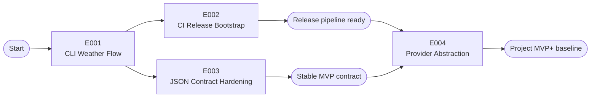

# Project Implementation Plan

Product: weather-cli | Created: 2026-04-06 | Status: Draft | Total Epics: 4 (P1: 3, P2: 1, P3: 0) | Waves: 3

## Epic Checklist

### Wave 1 — MVP Runtime

> Establish the first working weather lookup path end to end: command entry, coordinate validation, Open-Meteo retrieval, and basic normalized success output.

- [ ] E001 [P1] [PRODUCT] {PRD:CAP-001,CAP-002}{SAD:ADR-001,ADR-002} CLI Weather Flow — standalone Go CLI with coordinate input and live current-weather retrieval

### Wave 2 — Delivery Foundation

> Add delivery automation early so packaging, testing, and release behavior are validated before contract hardening and future-proofing work expands the codebase.

- [ ] E002 [P1] [TECHNICAL] {SAD:ADR-005} CI Release Bootstrap — GitHub Actions and GoReleaser pipeline for build, test, and multi-platform artifacts
- [ ] E003 [P1] [PRODUCT] [P] {PRD:CAP-003,CAP-004}{SAD:ADR-003,ADR-004} JSON Contract Hardening — stable success and failure envelopes with exit-code semantics and tests

### Wave 3 — Evolution Readiness

> Refine internal boundaries so provider-specific concerns stay isolated as the product grows beyond the first provider.

- [ ] E004 [P2] [TECHNICAL] {PRD:CAP-005}{SAD:ADR-002} Provider Abstraction — internal adapter boundary and compatibility protections for future provider changes

## Dependency Diagram

## Execution Wave Summary

| Wave | Epics | All Parallel? | Notes |
|------|-------|---------------|-------|
| 1 | E001 | No | Establishes the runnable CLI structure, weather fetch path, and shared domain baseline |
| 2 | E002, E003 | Yes | CI/release automation and contract hardening can proceed together once the first runnable flow exists |
| 3 | E004 | No | Depends on both stable release automation and a settled response contract |

## Parallel Execution Guidance

### Independent Epics

| Epic Pair | Why Parallel Is Safe |
|-----------|----------------------|
| E002 + E003 | Release automation touches workflow and packaging assets while contract hardening focuses on response models, exit codes, and tests |

### Integration Risks

| Epic Pair | Risk |
|-----------|------|
| E001 -> E003 | Contract hardening may require reshaping models created during the first runnable CLI implementation |
| E001 -> E002 | Packaging assumptions may change if the CLI entrypoint layout or build target names drift during early implementation |
| E002 + E004 | Provider abstraction changes may require release-path updates if binary naming, config, or module layout changes |

### Shared Resource Conflicts

| Resource | Introduced By | Potential Conflict |
|----------|---------------|--------------------|
| `/src/cmd` and `/src/internal` package layout | E001 | E003 and E004 must extend the structure without renaming core paths unexpectedly |
| Release workflow configuration | E002 | Later packaging or naming changes from E004 may require synchronized workflow updates |
| Response schema fixtures | E003 | E004 must preserve contract fixtures while changing provider internals |

## Epic Details

### E001 — CLI Weather Flow

- **Category**: PRODUCT
- **Priority**: P1
- **Source**: `{PRD:CAP-001,CAP-002}{SAD:ADR-001,ADR-002}`
- **Scope**: Build the first runnable Go CLI under `/src` with a command entrypoint, coordinate parsing and validation, outbound Open-Meteo client, and basic normalized success output. This epic proves the core product value with a real end-to-end invocation path.
- **Actors**: CLI user, automation script
- **Key entities**: Coordinate input, provider request, current weather payload, normalized success response
- **Depends on**: none
- **Dependency contracts**: none
- **Depended on by**: E002, E003
- **Produces (shared)**: `/src` project structure, CLI entrypoint, Open-Meteo client package, initial response model, build target naming
- **Constraints**: Must remain a standalone executable; all source code under `/src`; no persistent storage; success path must be machine-readable JSON
- **Acceptance criteria**:
- [ ] A Go module and `/src` application layout exist for a standalone CLI binary
- [ ] The CLI accepts latitude and longitude parameters and validates malformed input before HTTP calls
- [ ] The CLI fetches current weather from Open-Meteo for valid coordinates
- [ ] The CLI emits a basic normalized success JSON payload to stdout
- [ ] Unit tests cover input validation and provider response mapping basics
- **Specify input**:
- Description: Build the first runnable weather-cli flow in Go under `/src` with coordinate args, Open-Meteo current weather retrieval, and JSON success output
- Actors: Developers, automation scripts
- Key entities: Coordinates, provider payload, normalized weather response
- Depends on artifacts: [specs/prd.md](/C:/Endava/EndevLocal/Repos/weather-cli-demo-2/specs/prd.md), [specs/sad.md](/C:/Endava/EndevLocal/Repos/weather-cli-demo-2/specs/sad.md)
- Constraints: Use Go; keep the CLI standalone; no forecast/geocoding scope

### E002 — CI Release Bootstrap

- **Category**: TECHNICAL
- **Priority**: P1
- **Source**: `{SAD:ADR-005}`
- **Scope**: Establish GitHub Actions workflows and GoReleaser configuration to build, test, and package the CLI for macOS, Windows, and Linux as early as possible. This epic makes delivery repeatable before the remaining hardening work lands.
- **Actors**: Maintainer, release operator
- **Key entities**: GitHub workflow, release archive, binary artifact, version tag
- **Depends on**: E001
- **Dependency contracts**: Requires CLI entrypoint path, binary name, and runnable `go test` baseline from E001
- **Depended on by**: E004
- **Produces (shared)**: `.github/workflows` release automation, GoReleaser config, artifact naming convention, release trigger contract
- **Constraints**: Must target macOS, Windows, and Linux; must run through GitHub Actions; should validate build and test on push before tagged release publication
- **Acceptance criteria**:
- [ ] A GitHub Actions workflow runs Go test and build validation on repository changes
- [ ] A release workflow packages binaries for macOS, Windows, and Linux
- [ ] GoReleaser configuration defines the canonical binary and archive outputs
- [ ] Release automation documentation or inline workflow notes make tag-based publishing expectations clear
- **Specify input**:
- Description: Add GitHub Actions and GoReleaser so weather-cli builds, tests, and releases cross-platform binaries
- Actors: Maintainers
- Key entities: Workflow files, release archives, binary artifacts
- Depends on artifacts: E001 CLI entrypoint and binary naming
- Constraints: GitHub Actions should exist early; use GoReleaser for packaging
- **Pipeline hints**: `skip_clarify`, `skip_checklist`, `lightweight`

### E003 — JSON Contract Hardening

- **Category**: PRODUCT
- **Priority**: P1
- **Source**: `{PRD:CAP-003,CAP-004}{SAD:ADR-003,ADR-004}`
- **Scope**: Finalize the stable normalized success and failure envelopes, define exit-code semantics, and protect them with focused tests and fixtures. This epic turns the first runnable flow into a dependable automation contract.
- **Actors**: CLI user, automation script
- **Key entities**: Success response envelope, error envelope, exit code map, contract fixtures
- **Depends on**: E001
- **Dependency contracts**: Requires initial response model, validation path, and provider invocation flow from E001
- **Depended on by**: E004
- **Produces (shared)**: Stable JSON schema, structured errors, exit-code taxonomy, contract tests and fixtures
- **Constraints**: Must emit structured JSON for both success and failure; no plain-text-only failure mode; contract should shield consumers from provider schema drift
- **Acceptance criteria**:
- [ ] Success responses use a stable normalized top-level schema
- [ ] Failure responses use a structured error envelope with consistent fields
- [ ] Non-zero exit codes distinguish validation, network, provider, and internal failures
- [ ] Tests lock the response contract and representative failure paths
- **Specify input**:
- Description: Harden weather-cli output into a stable JSON contract with structured errors and exit-code semantics
- Actors: Developers, automation scripts
- Key entities: JSON contract, error payload, exit code taxonomy
- Depends on artifacts: E001 response model and provider flow
- Constraints: Preserve machine-first UX; do not expose raw provider payloads as the public contract
- **Pipeline hints**: `skip_clarify`

### E004 — Provider Abstraction

- **Category**: TECHNICAL
- **Priority**: P2
- **Source**: `{PRD:CAP-005}{SAD:ADR-002}`
- **Scope**: Refine the internal provider boundary so Open-Meteo specifics remain isolated behind a durable adapter contract. This epic improves maintainability and prepares the codebase for provider evolution without changing the public CLI contract.
- **Actors**: Maintainer
- **Key entities**: Provider interface, adapter implementation, contract mapper, compatibility tests
- **Depends on**: E002, E003
- **Dependency contracts**: Requires the canonical binary/release structure from E002 and the stable response contract and fixtures from E003
- **Depended on by**: none
- **Produces (shared)**: Provider interface boundary, adapter test seam, compatibility protections, clearer internal module ownership
- **Constraints**: Must not change the public JSON contract; should preserve the zero-setup MVP provider path
- **Acceptance criteria**:
- [ ] Provider-specific HTTP and field mapping logic is isolated behind a dedicated internal abstraction
- [ ] Compatibility tests prove the public contract remains unchanged after the abstraction split
- [ ] Internal package boundaries make future provider substitution feasible without CLI contract redesign
- **Specify input**:
- Description: Refine internal provider boundaries so weather-cli can evolve beyond the initial Open-Meteo integration safely
- Actors: Maintainers
- Key entities: Provider interface, adapter, compatibility tests
- Depends on artifacts: E002 release baseline, E003 contract fixtures
- Constraints: Keep Open-Meteo as default MVP provider; no user-facing provider-selection feature yet
- **Pipeline hints**: `skip_clarify`, `lightweight`

## Coverage Validation

### PRD Coverage

| PRD Capability | Covered By | Notes |
|----------------|------------|-------|
| CAP-001 | E001 | Coordinate parsing and validation |
| CAP-002 | E001 | Live current-weather retrieval |
| CAP-003 | E003 | Stable success contract |
| CAP-004 | E003 | Structured error handling and exit codes |
| CAP-005 | E004 | Provider abstraction boundary |

### SAD Coverage

| SAD Decision | Covered By | Notes |
|--------------|------------|-------|
| ADR-001 | E001 | Go CLI implementation baseline |
| ADR-002 | E001, E004 | Open-Meteo integration first, abstraction later |
| ADR-003 | E003 | Stable normalized JSON contract |
| ADR-004 | E003 | Structured failures with exit codes |
| ADR-005 | E002 | GitHub Actions and GoReleaser release path |

### DOD Coverage

| DOD Decision | Covered By | Notes |
|--------------|------------|-------|
| N/A | N/A | No deployment and operations document registered yet |

### Uncovered Items

| Source | Item | Rationale |
|--------|------|-----------|
| DOD | Operational decisions | No deployment and operations document exists yet; operational decomposition will need refinement if one is added later |

## Shared Artifact Surface

### Shared Data Entities

| Entity | Introduced By | Consumed By |
|--------|---------------|-------------|
| Coordinate input | E001 | E003 |
| Normalized weather response | E001 | E003, E004 |
| Error envelope | E003 | E004 |

### API Surfaces

| Surface | Introduced By | Consumed By |
|---------|---------------|-------------|
| Open-Meteo provider client | E001 | E004 |
| CLI stdout JSON contract | E003 | E004 |

### Libraries/Modules

| Library or Module | Introduced By | Consumed By |
|-------------------|---------------|-------------|
| CLI command layer | E001 | E002, E003 |
| Release workflow and GoReleaser config | E002 | E004 |
| Contract fixtures and exit-code map | E003 | E004 |

## Wave Transition Protocol

- Verify all epics in the current wave have passed quality checks before starting the next wave
- Verify shared artifacts named in dependency contracts exist and are still satisfiable by downstream epics
- Verify technical context is updated if implementation choices materially change package structure, contract shape, or release strategy
- Verify release automation remains green after any downstream changes that affect binary naming, build layout, or platform targets
