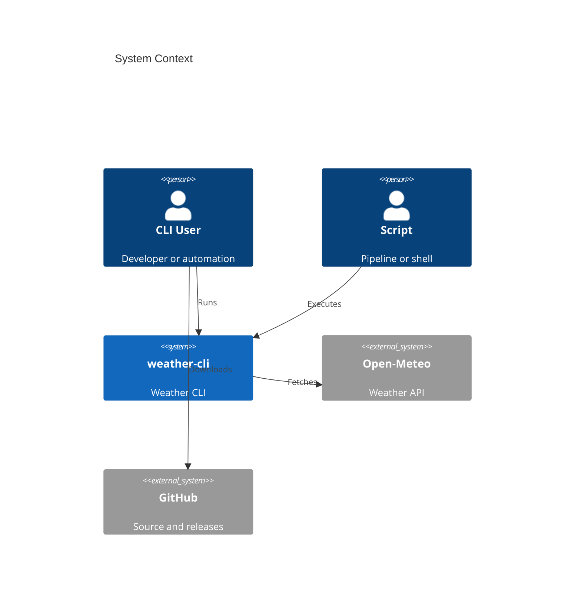
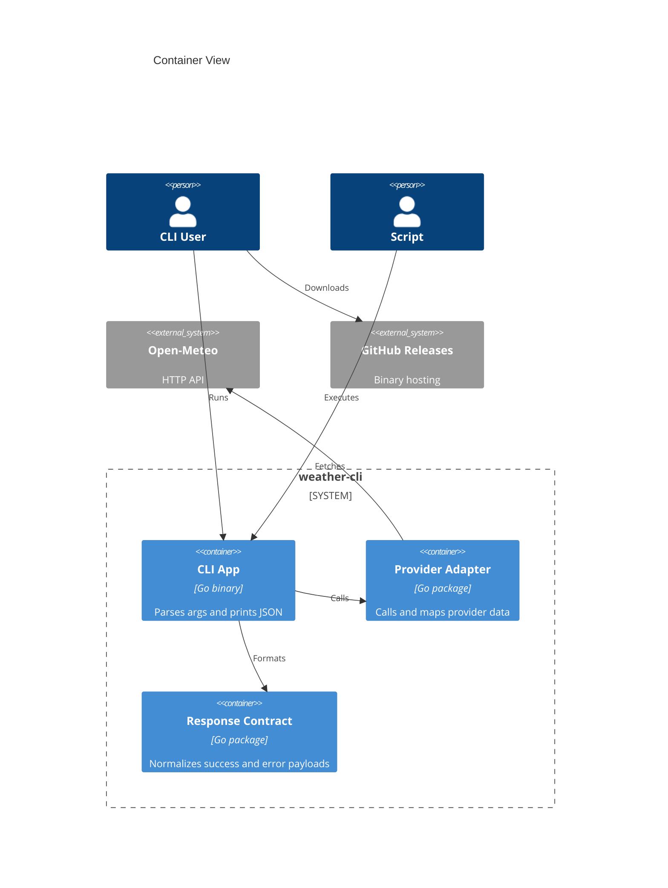
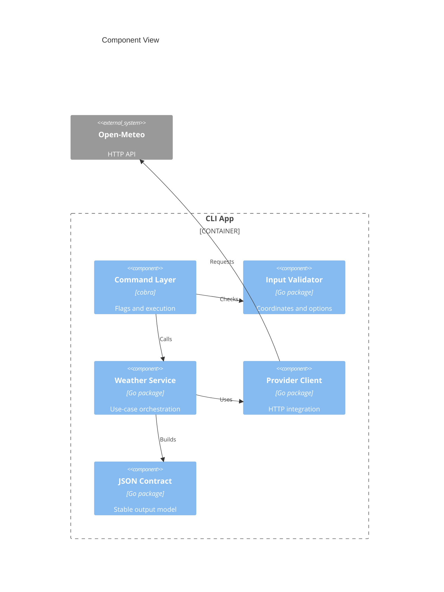
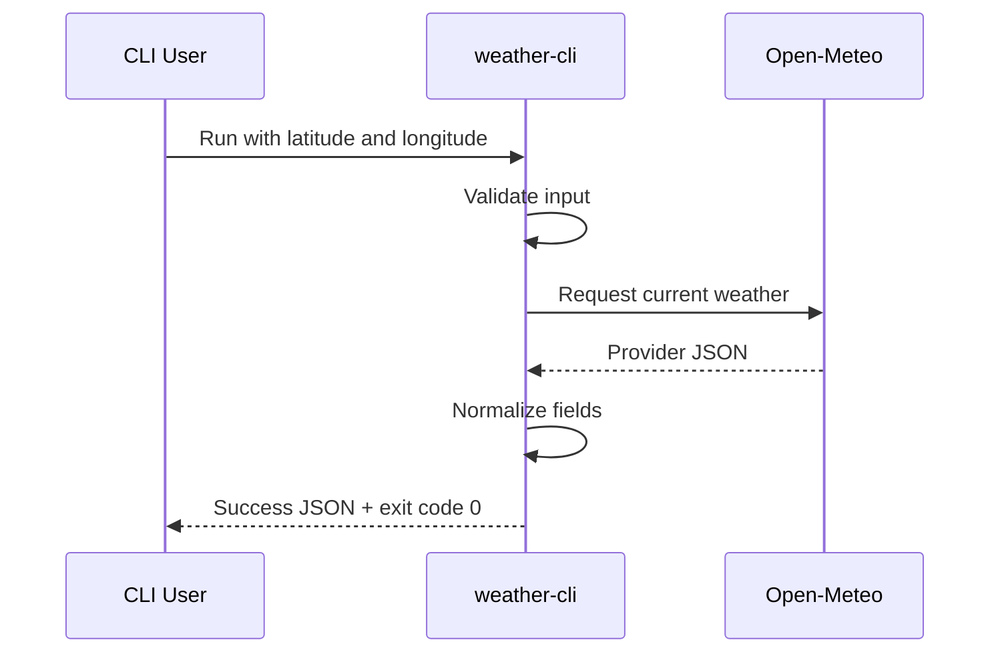
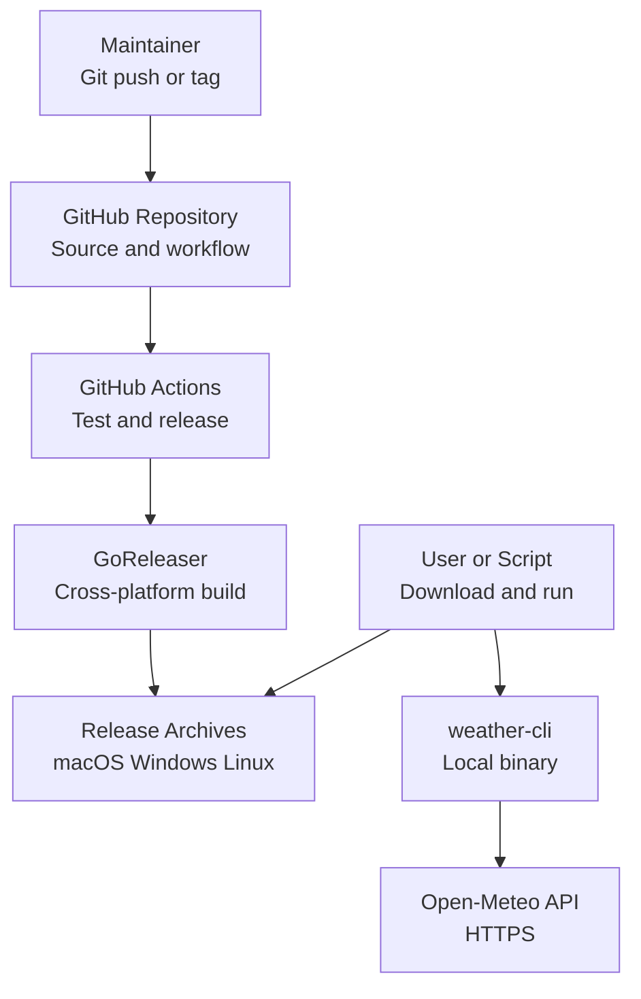

# Software Architecture Document: weather-cli

> Date: 2026-04-06 | Status: Draft

## Purpose and Scope

weather-cli is a standalone command-line application that retrieves current weather conditions for a supplied latitude and longitude and emits a normalized JSON response. The architecture is intentionally narrow: a single executable, no persistent storage, a small provider abstraction for live weather retrieval, and a release pipeline that produces distributable binaries for macOS, Windows, and Linux.

## Technical Context

**Language/Version**: Go 1.24  
**Primary Dependencies**: Go standard library, Cobra for CLI command structure, Open-Meteo HTTP API, GitHub Actions, GoReleaser 
**Storage**: N/A  
**Testing**: `go test`, table-driven unit tests, integration tests with mocked upstream responses 
**Target Platform**: Desktop CLI on macOS, Windows, and Linux  
**Project Type**: single application 
**Performance Goals**: Median successful command completion <= 2 seconds on normal network conditions; startup overhead < 100 ms before network I/O  
**Constraints**: Must remain a standalone executable, must return JSON for both success and failure paths, must tolerate upstream dependency issues without corrupt output, must be releasable through GitHub Actions  
**Scale/Scope**: Single-user CLI execution, one coordinate pair per invocation, MVP validation for developer and automation use

## System Scope and Context

The system boundary contains a single local executable that validates input, requests live data from a weather provider, normalizes the provider payload into a stable CLI contract, and writes JSON to standard output while signaling outcome via exit code. External context is intentionally limited to the invoking user or script, the upstream weather API, and GitHub-hosted release infrastructure.

### C4 System Context

### C4 Container View

### C4 Component View

## Solution Strategy and Architecture Style

- **Architecture Style**: Modular single-binary CLI with provider adapter boundary
- **Source Code Location**: All project source code must reside in the `/src` directory.
- **Why this style fits**: The product scope is a single command-line executable with one external integration and no persistence. A modular CLI keeps packaging simple while still isolating provider-specific logic, contract shaping, and failure handling behind stable internal boundaries.
- **Alternatives considered**: Direct raw-provider passthrough was rejected because it couples consumers to upstream schema changes. A plugin-oriented multi-provider architecture was rejected for MVP because it adds operational complexity before a second provider is justified.

## Key Runtime Flows and Failure Paths

### Primary Flow

### Failure Paths

- Invalid coordinates -> fail fast before network I/O, emit structured error JSON, return validation-specific non-zero exit code
- Provider timeout or network failure -> emit structured downstream error JSON, return retryable non-zero exit code, avoid partial payloads
- Provider schema drift or missing required fields -> emit internal/downstream mapping error JSON, return non-zero exit code, log diagnostic detail to stderr only when debug mode exists
- GitHub release pipeline failure -> block artifact publication, preserve existing released binaries, surface failure in GitHub Actions logs

## Deployment and Infrastructure View

## Cross-Cutting Concerns

### Security

The CLI does not manage user accounts or long-lived secrets in MVP. Trust boundaries are limited to local argument input, outbound HTTPS requests, and GitHub-hosted release artifacts. The release pipeline should use GitHub-hosted tokens only, pin action versions, and avoid embedding provider credentials in binaries. Input validation must reject malformed coordinates early to reduce misuse and ambiguous behavior.

### Reliability

Reliability depends on explicit validation, bounded HTTP timeouts, deterministic response shaping, and no silent fallback to stale or guessed data. The CLI should fail fast on local validation problems and use small, bounded retry behavior only where it materially improves transient network resilience. Provider outages must never produce malformed success payloads.

### Observability

The MVP observability baseline is lightweight: structured internal log messages for debug and CI diagnosis, clear exit codes, and stable error payloads for automation. Release automation should expose build, test, and packaging failures through GitHub Actions logs and release status. Runtime telemetry collection is not required for the standalone CLI MVP.

### Data Management

The application is stateless and stores no persistent domain data. Weather responses exist only in process memory for the duration of a command. No caching, backup, migration, or retention workflow is needed in the MVP architecture.

### Integration Strategy

The product integrates with Open-Meteo through a dedicated provider client that maps provider-specific fields into a normalized CLI response model. This keeps upstream-specific transport details separate from the user-facing contract and leaves room for future provider substitution without redefining CLI semantics.

### Operations

Operational ownership centers on repository maintenance, release automation, and provider compatibility. GitHub Actions runs tests on pushes and tagged releases, while GoReleaser packages binaries and publishes release assets. Initial support expectations are developer-oriented: diagnose failures through command output, reproducible test coverage, and CI logs rather than through a live operations stack.

## Quality Attributes

| Attribute | Target | Measurement | Notes |
|-----------|--------|-------------|-------|
| Performance | Median completion <= 2 seconds | Timed integration runs against provider or controlled mocks | Excludes unusually degraded public internet conditions |
| Reliability | >= 95% successful responses for valid requests during validation | Pilot test runs and CI integration checks | Bounded by upstream provider availability |
| Security | No embedded secrets; pinned release workflow dependencies | CI review of workflow and dependency configuration | MVP security scope is supply-chain and input safety |
| Maintainability | Provider-specific logic isolated to dedicated packages | Package boundaries and unit test coverage review | Supports future provider swap with low contract churn |
| Scalability | Support repeated single-request invocations without shared state | Repeated CLI execution tests | Horizontal scale is user-side through independent invocations |

## Architecture Decisions

### ADR-001: Use Go for a Single-Binary Cross-Platform CLI

- **Status**: Accepted
- **Context**: The product must ship as a standalone executable for macOS, Windows, and Linux with minimal install friction.
- **Decision**: Implement the application in Go and target native binaries built through standard Go tooling.
- **Rationale**: Go produces portable static binaries, has strong standard-library support for HTTP and JSON, and fits the operational simplicity expected from CLI tooling.
- **Alternatives Considered**: Python was rejected because executable distribution is heavier. Node.js was rejected because runtime bundling adds complexity for the standalone packaging goal.
- **Tradeoffs**: Go improves portability and release ergonomics but narrows the implementation ecosystem compared with more dynamic runtimes.
- **Consequences**: Project code should favor idiomatic Go package boundaries, table-driven testing, and standard-library-first implementation patterns.

### ADR-002: Use Open-Meteo as the Default MVP Provider

- **Status**: Accepted
- **Context**: The MVP needs coordinate-based current weather access with low setup friction and a JSON-friendly API.
- **Decision**: Use Open-Meteo as the initial upstream provider behind a provider adapter.
- **Rationale**: Open-Meteo supports coordinate-driven queries, current weather fields, and JSON responses that match the MVP product direction without immediately forcing user-managed credentials.
- **Alternatives Considered**: Direct use of commercial providers was rejected for MVP due to added credential and cost friction. Multi-provider support was rejected as premature.
- **Tradeoffs**: Onboarding is simpler, but provider-specific availability and schema behavior remain an external dependency risk.
- **Consequences**: The CLI contract must normalize upstream fields and keep provider metadata explicit in the response.

### ADR-003: Define a Stable Normalized JSON Contract

- **Status**: Accepted
- **Context**: CLI consumers need a stable machine-readable contract that will not break when provider payloads evolve.
- **Decision**: Emit a normalized top-level JSON schema with `location`, `current`, `source`, and `timestamp` sections for success, plus a parallel structured error envelope for failures.
- **Rationale**: A stable contract protects automation users from provider drift and makes provider substitution feasible later.
- **Alternatives Considered**: Raw provider passthrough was rejected because it leaks upstream volatility. Human-readable default output was rejected because the PRD prioritizes machine consumption.
- **Tradeoffs**: The CLI owns a mapping layer and versioning responsibility, but consumers gain stability.
- **Consequences**: Response contract tests become a core part of compatibility protection.

### ADR-004: Use Structured JSON Errors with Exit Codes

- **Status**: Accepted
- **Context**: Automation users need predictable parsing and control flow when commands fail.
- **Decision**: Return structured JSON for both success and failure and use distinct non-zero exit codes for validation, network, provider, and internal errors.
- **Rationale**: This gives scripts both a parseable body and a shell-native failure signal.
- **Alternatives Considered**: Plain-text stderr-only errors were rejected because they are harder to automate reliably. Returning zero for recoverable downstream failures was rejected because it hides operational issues.
- **Tradeoffs**: Error taxonomy design requires more upfront discipline, but downstream automation becomes simpler and safer.
- **Consequences**: Failure-mode tests and contract documentation must define exit-code semantics clearly.

### ADR-005: Release with GitHub Actions and GoReleaser

- **Status**: Accepted
- **Context**: The project needs repeatable multi-platform executable releases from the source repository.
- **Decision**: Use GitHub Actions for CI and tagged-release orchestration, with GoReleaser generating archives for macOS, Windows, and Linux.
- **Rationale**: GitHub Actions is the requested CI platform, and GoReleaser is a well-established approach for packaging and publishing Go binaries across operating systems.
- **Alternatives Considered**: Manual release scripting was rejected due to poor repeatability. Per-platform bespoke workflows were rejected because they increase maintenance cost.
- **Tradeoffs**: The pipeline depends on tag discipline and release configuration quality, but release operations stay centralized and reproducible.
- **Consequences**: The repository should include pinned GitHub Actions workflow definitions and GoReleaser configuration as part of the core delivery baseline.

## Risks, Assumptions, Constraints, and Open Questions

### Risks

- Open-Meteo schema or availability changes could break provider mapping until compatibility updates are shipped.
- Cross-platform packaging may eventually require code-signing or notarization expectations beyond the MVP release baseline.
- A too-narrow initial contract may omit fields that users immediately need in automation contexts.

### Assumptions

- Users prefer zero-setup provider access for MVP over configurable provider credentials.
- A single command and single provider are sufficient to validate product usefulness before broader expansion.
- GitHub-hosted releases are an acceptable binary distribution channel for early adopters.

### Constraints

- The application must stay within standalone CLI boundaries and not evolve into a long-running service.
- All project source code must live under `/src`.
- The release process must run through GitHub Actions and produce binaries for macOS, Windows, and Linux.

### Open Questions

- Which exact current-weather fields should be mandatory in the normalized `current` object for v1?
- Should the CLI expose a schema version field in every response from the first release?
- Is artifact signing required for the first public release, or can it be deferred until distribution broadens?

## Project Context Baseline Updates

- The canonical stack is Go-based with GitHub Actions release automation and cross-platform binary packaging.
- The product architecture is a stateless single-binary CLI with a dedicated provider adapter and normalized JSON contract.
- Open-Meteo is the default MVP provider, but provider-specific details are isolated behind internal abstractions.
- The release baseline targets macOS, Windows, and Linux through tagged GitHub releases.
